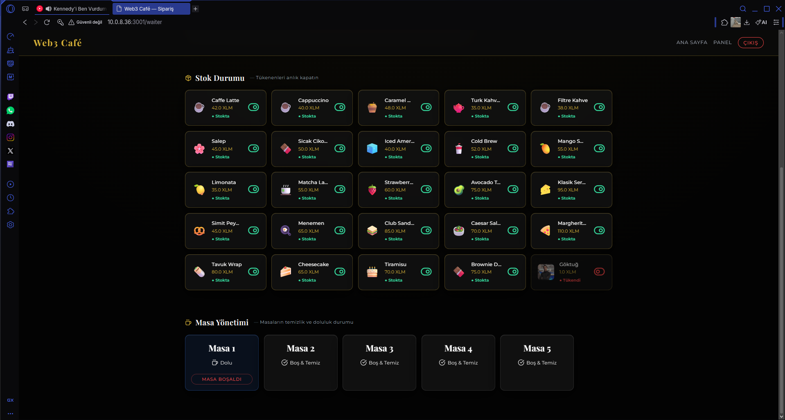
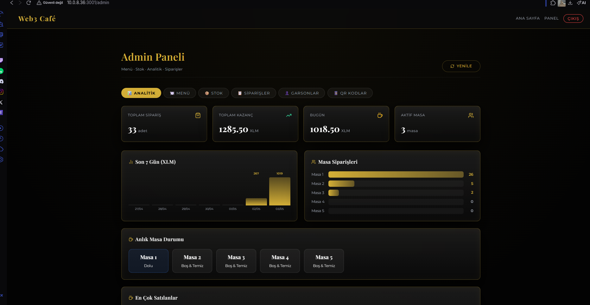
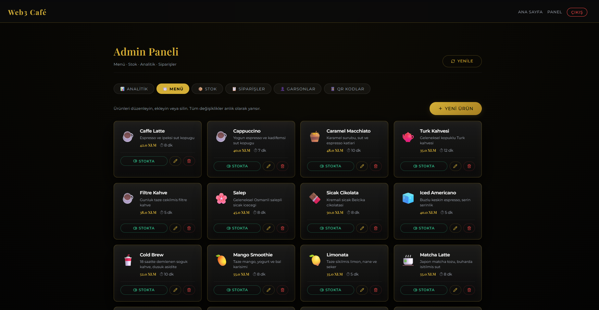
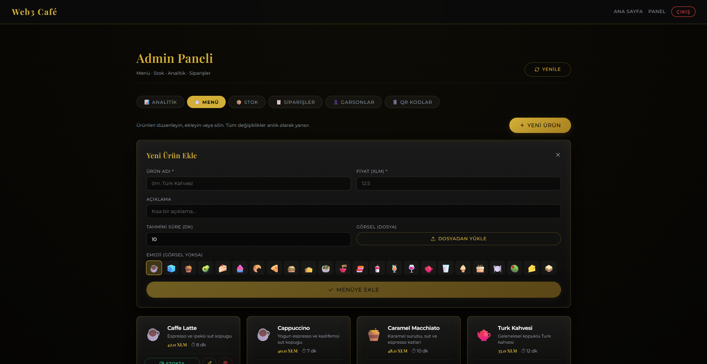
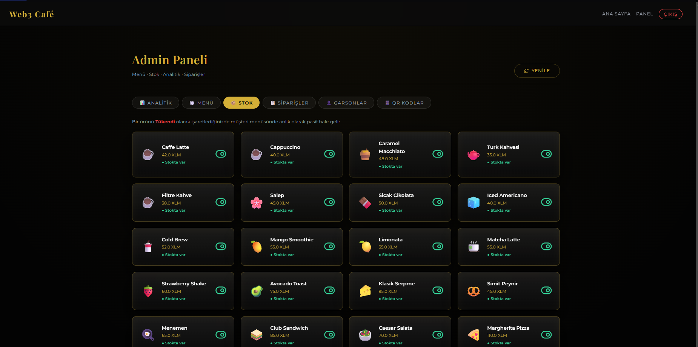
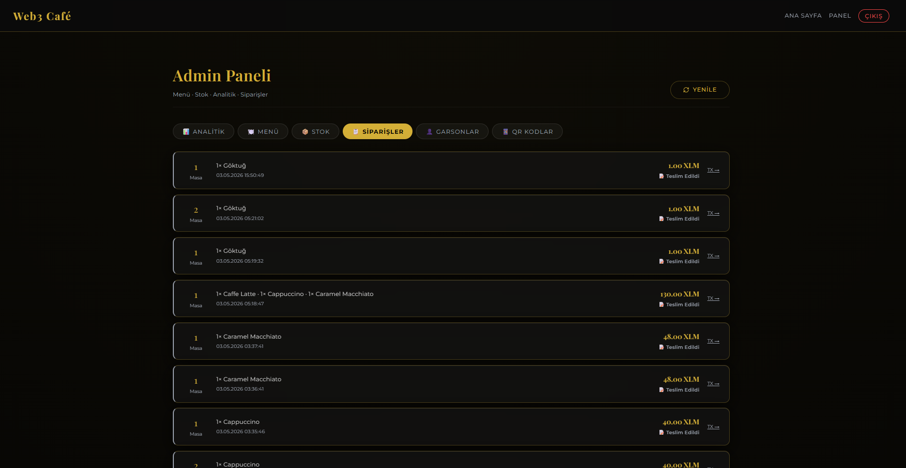

# ☕ Web3 Café POS

A real-time, QR-based café ordering system powered by the **Stellar blockchain**. Customers pay with XLM via Freighter or Albedo — funds are locked in a **Soroban smart contract escrow** and released to the café owner upon delivery.

🔗 **Live Contract:** [`CCDRWVJT...XK`](https://stellar.expert/explorer/testnet/contract/CCDRWVJTAIOB7TADJEE6XYG2EZSH3CLE35AN5BWEVVAANRNGDXY53VXK) on Stellar Testnet

---

## How It Works

```
Customer scans QR → Browses menu → Pays with XLM (Freighter/Albedo)
       ↓
Soroban contract locks XLM in escrow (create_order)
       ↓
Waiter marks order as "Delivered"
       ↓
Backend calls fulfill_order → XLM released to café owner
```

**Two payment paths:**
- **Freighter (desktop)** — XLM is locked in escrow via Soroban contract. Released only after delivery is confirmed.
- **Albedo (mobile)** — Direct XLM transfer to café owner. No escrow, no Freighter extension needed.

---

## Screenshots

<div style="display: flex; gap: 10px; flex-wrap: wrap; margin-bottom: 20px;">
  
  
  
  
  
  
</div>

---

## Stack

| Layer | Tech |
|-------|------|
| Frontend | React 18, TypeScript, Vite, Framer Motion, Socket.IO client |
| Backend | Node.js, Express, Socket.IO, SQLite (better-sqlite3), Multer |
| Blockchain | Stellar Testnet, Soroban SDK 25, `@stellar/stellar-sdk` v14 |
| Wallets | Freighter (`@stellar/freighter-api`), Albedo (`@albedo-link/intent`) |

---

## Project Structure

```
Web3_Menu/
├── backend/          # Express server, SQLite DB, Socket.IO, QR generator
├── frontend/         # React app (Menu, WaiterPanel, AdminPanel, Landing)
│   └── src/lib/      # posContract.ts — Soroban tx builder & Albedo pay
├── contracts/pos/    # Soroban smart contract (Rust, no_std)
└── Masa_QRCodes/     # Generated QR PNG files for 5 tables
```

---

## Quick Start

```bash
# 1. Backend (port 4000)
cd backend && npm install && npm run dev

# 2. Frontend (port 3001)
cd frontend && npm install && npm run dev

# 3. Generate QR codes for tables
cd backend && node generate_qrs.js
```

> Vite automatically proxies `/api`, `/uploads`, and `/socket.io` to `:4000`.

---

## Roles

| Role | Access | Credentials |
|------|--------|-------------|
| Customer | Menu, cart, XLM payment | QR code → `/menu/:tableId` |
| Waiter | Orders, stock, table status | Username + PIN (default: `Garson 1` / `1234`) |
| Admin | All waiter access + menu & analytics | `admin` / `1111` |

---

## Smart Contract

**Language:** Rust (`no_std`) · **SDK:** soroban-sdk 25.0.1 · **Network:** Stellar Testnet

| | |
|--|--|
| **Contract ID** | `CCDRWVJTAIOB7TADJEE6XYG2EZSH3CLE35AN5BWEVVAANRNGDXY53VXK` |
| **Deployment Transaction** | [`eeef6734244d986be2f363039d16b7ee1133c607c5f4832637a128882d425fee`](https://stellar.expert/explorer/testnet/tx/eeef6734244d986be2f363039d16b7ee1133c607c5f4832637a128882d425fee) |
| **Deployed** | May 2, 2026 — Ledger #2348744 |
| **Deployer** | `GDDCU4GYVJTV45NUFG3WYXUG4Q2BA54UUWPGRFVPOHGDNWN2U4E6K4B7` |
| **Native Token** | `CDLZFC3SYJYDZT7K67VZ75HPJVIEUVNIXF47ZG2FB2RMQQVU2HHGCYSC` |
| **Café Owner** | `GDSPUJG45447VF2YSW6SIEYHZVPBCVQVBXO2BS3ESA5MHPCXUJHBAFDA` |

### Contract Functions

```rust
// Locks XLM from customer into contract escrow. Returns order_id (u32).
create_order(customer, token_address, amount, items) → u32

// Releases escrowed XLM to café owner. Called by backend on delivery.
fulfill_order(waiter, order_id, token_address, cafe_owner)

// Read-only: returns order struct for a given order_id.
get_order(order_id) → Order
```

---

## API & Real-time Events

**Key REST endpoints** (`localhost:4000`):

| Method | Path | Description |
|--------|------|-------------|
| GET | `/api/menu` | All menu items |
| GET | `/api/orders/active` | Non-delivered orders |
| GET | `/api/get-order-id/:txHash` | Parse contract order_id from transaction |
| POST | `/api/update-order-contract-id` | Link transaction hash to DB order |
| GET | `/api/analytics` | Revenue & order stats |

**Key Socket.IO events** (bidirectional real-time sync):

`create_order` · `update_order_status` · `update_table_status` · `set_stock` · `add_menu_item` · `sync_orders` · `sync_menu` · `sync_tables` · `new_order_alert`

---

## Notes

- Runs on **Stellar Testnet** — no real XLM involved.
- QR codes embed the machine's local IP. Re-run `generate_qrs.js` if the IP changes.
- `cafe.db`, `uploads/`, and `target/` are excluded from git (`.gitignore`).

---

MIT © 2026 Web3 Café POS
